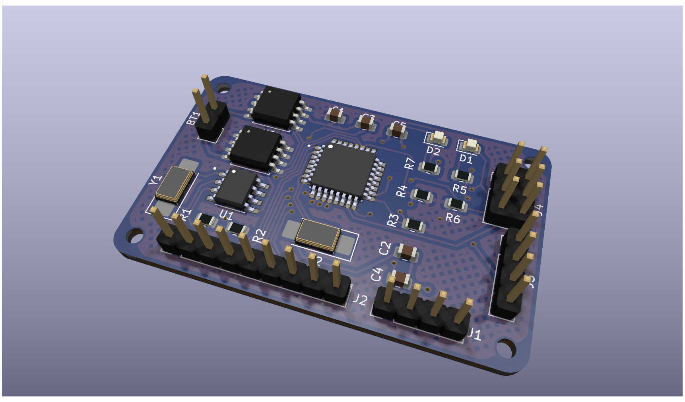

# **MCU Datalogger**
### A minimal MCU-based datalogger built in KiCad  

  <kbd style="padding:3px 14px; font-size:14px; background:#007BFF; color:white;">MCU: ATmega328P-AU</kbd>
  <kbd style="padding:3px 14px; font-size:14px; background:#FF9800; color:white;">RTC: DS3231M</kbd>
  <kbd style="padding:3px 14px; font-size:14px; background:#4CAF50; color:white;">Memory: 24LC1025 × 2</kbd>
  <kbd style="padding:3px 14px; font-size:14px; background:#9C27B0; color:white;">KiCad</kbd>

---

## ✨ **Overview**

*A complete KiCad project implementing a simple microcontroller-based datalogger with real-time clock and external memory.*

This project demonstrates how to build a compact datalogger around the **ATmega328P-AU**, with accurate timestamping provided by a **DS3231M RTC** and extended non-volatile storage using **dual 24LC1025 I²C EEPROMs**.  
It is designed as a project for learning KiCad, schematic design, and PCB layout.

--- 

## 🔧 **Key Features**

-  **ATmega328P-AU** microcontroller (Arduino-ready)  
-  **DS3231M RTC** with backup battery support  
-  **2 × 24LC1025 EEPROM** → total **256 KB** storage  
-  Hardware 16 MHz crystal oscillator  
-  UART, SPI, I²C breakout connector  
-  ISP programming support  
-  Status LED    

---
## Final PCB Render

  

